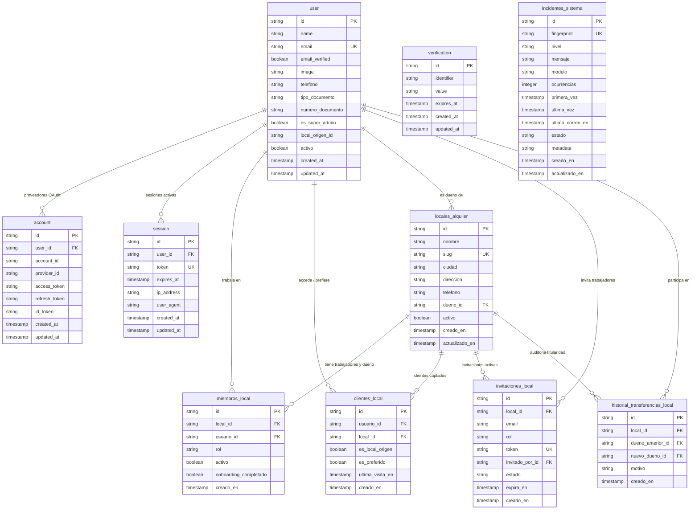

# Base de Datos - Sistema de Alquiler de Vehículos

## Arquitectura de Datos y Multi-Tenancy

El sistema utiliza **Cloudflare D1 (SQLite en el Edge)** gestionado mediante **Drizzle ORM**. La arquitectura implementa un modelo **Multi-Tenant jerárquico**:
- La plataforma soporta múltiples locales o sedes de servicio de alquiler de vehículos (`locales_alquiler`).
- La autenticación es provista por **Better Auth** con soporte para inicio de sesión sin contraseña (**Email OTP**) y **Google OAuth**.
- Los empleados y dueños pertenecen a mínimo un local (`miembros_local`) con roles granulares de sede (`DUENO`, `ADMIN`, `OPERATIVO`, `AUDITOR_FINANCIERO`).
- Los clientes finales (`USUARIO`) pueden explorar catálogos de diferentes locales, y el sistema rastrea sus comercios preferidos, histórico de accesos y local de captación de origen (`clientes_local`) para **prevenir la fuga de clientes**.
- Los dueños de local pueden emitir invitaciones seguras con token (`invitaciones_local`) para vincular personal y transferir la titularidad del local a otro usuario (`historial_transferencias_local`).

---

## Esquema Módulos & Entidades

### 1. Módulo Autenticación (Better Auth)

#### `user`
Almacena la identidad de todos los usuarios (clientes, trabajadores, dueños y superadministradores).

| Campo | Tipo | Restricciones | Descripción |
|-------|------|---------------|-------------|
| `id` | TEXT | PRIMARY KEY | Identificador único del usuario. |
| `name` | TEXT | NOT NULL | Nombre completo. |
| `email` | TEXT | NOT NULL, UNIQUE | Correo electrónico de inicio de sesión. |
| `email_verified` | INTEGER (boolean) | NOT NULL, DEFAULT false | Estado de verificación del correo. |
| `image` | TEXT | NULLABLE | URL del avatar (provisto por Google OAuth). |
| `telefono` | TEXT | NULLABLE | Teléfono de contacto directo. |
| `tipo_documento` | TEXT | NULLABLE | Tipo de documento ('CC', 'CE', 'PASAPORTE', 'NIT'). |
| `numero_documento` | TEXT | NULLABLE | Número de identificación oficial. |
| `es_super_admin` | INTEGER (boolean) | NOT NULL, DEFAULT false | Privilegios globales de plataforma. |
| `local_origen_id` | TEXT | NULLABLE | ID del local donde fue captado el cliente. |
| `activo` | INTEGER (boolean) | NOT NULL, DEFAULT true | Estado de habilitación de la cuenta. |
| `created_at` | TIMESTAMP | NOT NULL | Fecha de creación. |
| `updated_at` | TIMESTAMP | NOT NULL | Fecha de última actualización. |

#### `session`
Manejo de sesiones activas en Better Auth.

| Campo | Tipo | Restricciones | Descripción |
|-------|------|---------------|-------------|
| `id` | TEXT | PRIMARY KEY | ID de sesión. |
| `user_id` | TEXT | NOT NULL, FK `user.id` | Usuario titular. |
| `token` | TEXT | NOT NULL, UNIQUE | Token de sesión firmado. |
| `expires_at` | TIMESTAMP | NOT NULL | Caducidad de la sesión. |
| `ip_address` | TEXT | NULLABLE | IP de conexión. |
| `user_agent` | TEXT | NULLABLE | Cliente/navegador. |
| `created_at` | TIMESTAMP | NOT NULL | Creación de sesión. |
| `updated_at` | TIMESTAMP | NOT NULL | Modificación. |

#### `account`
Cuentas externas asociadas (proveedor Google OAuth).

| Campo | Tipo | Restricciones | Descripción |
|-------|------|---------------|-------------|
| `id` | TEXT | PRIMARY KEY | ID de vinculación. |
| `user_id` | TEXT | NOT NULL, FK `user.id` | Usuario del sistema. |
| `account_id` | TEXT | NOT NULL | ID externo del proveedor. |
| `provider_id` | TEXT | NOT NULL | Identificador del proveedor ('google'). |
| `access_token` | TEXT | NULLABLE | Token de acceso OAuth. |
| `refresh_token` | TEXT | NULLABLE | Token de refresco OAuth. |
| `id_token` | TEXT | NULLABLE | Token OIDC de Google. |

#### `verification`
Códigos OTP de un solo uso (sin contraseña) y verificaciones temporales.

| Campo | Tipo | Restricciones | Descripción |
|-------|------|---------------|-------------|
| `id` | TEXT | PRIMARY KEY | ID de verificación. |
| `identifier` | TEXT | NOT NULL | Correo destino. |
| `value` | TEXT | NOT NULL | Código OTP o token seguro. |
| `expires_at` | TIMESTAMP | NOT NULL | Fecha de expiración. |

---

### 2. Módulo Multi-Tenant & Locales

#### `locales_alquiler`
Representa cada agencia o sede física de alquiler de vehículos.

| Campo | Tipo | Restricciones | Descripción |
|-------|------|---------------|-------------|
| `id` | TEXT | PRIMARY KEY | Identificador del local. |
| `nombre` | TEXT | NOT NULL | Nombre comercial (ej. 'Rentas Medellín Poblado'). |
| `slug` | TEXT | NOT NULL, UNIQUE | Identificador de URL (ej. 'medellin-poblado'). |
| `ciudad` | TEXT | NULLABLE | Ciudad de operación. |
| `direccion` | TEXT | NULLABLE | Ubicación física. |
| `telefono` | TEXT | NULLABLE | Teléfono de atención de la sede. |
| `dueno_id` | TEXT | NOT NULL, FK `user.id` | Dueño/propietario actual del local. |
| `activo` | INTEGER (boolean) | NOT NULL, DEFAULT true | Estado del local. |
| `creado_en` | TIMESTAMP | NOT NULL | Creación. |
| `actualizado_en` | TIMESTAMP | NOT NULL | Última modificación. |

#### `miembros_local`
Asignación de trabajadores y personal al local. Regla: todo empleado o dueño debe pertenecer a mínimo un local.

| Campo | Tipo | Restricciones | Descripción |
|-------|------|---------------|-------------|
| `id` | TEXT | PRIMARY KEY | Identificador de membresía. |
| `local_id` | TEXT | NOT NULL, FK `locales_alquiler.id` | Local asignado. |
| `usuario_id` | TEXT | NOT NULL, FK `user.id` | Trabajador o dueño. |
| `rol` | TEXT | NOT NULL | Rol en sede: 'DUENO', 'ADMIN', 'OPERATIVO', 'AUDITOR_FINANCIERO'. |
| `activo` | INTEGER (boolean) | NOT NULL, DEFAULT true | Habilitación en la sede. |
| `onboarding_completado` | INTEGER (boolean) | NOT NULL, DEFAULT false | Flag de inducción operativa inicial completada por el usuario. |
| `creado_en` | TIMESTAMP | NOT NULL | Fecha de alta. |

#### `clientes_local`
Vínculo entre clientes y locales para prevenir fuga comercial y rastrear comercios preferidos.

| Campo | Tipo | Restricciones | Descripción |
|-------|------|---------------|-------------|
| `id` | TEXT | PRIMARY KEY | Identificador de relación. |
| `usuario_id` | TEXT | NOT NULL, FK `user.id` | Cliente. |
| `local_id` | TEXT | NOT NULL, FK `locales_alquiler.id` | Local visitado o preferido. |
| `es_local_origen` | INTEGER (boolean) | NOT NULL, DEFAULT false | Indica si este local captó inicialmente al cliente. |
| `es_preferido` | INTEGER (boolean) | NOT NULL, DEFAULT false | Marcado como comercio favorito. |
| `ultima_visita_en` | TIMESTAMP | NULLABLE | Registro de última actividad. |
| `creado_en` | TIMESTAMP | NOT NULL | Fecha de registro. |

#### `invitaciones_local`
Invitaciones con token criptográfico emitidas por el dueño o creador para incorporar colaboradores.

| Campo | Tipo | Restricciones | Descripción |
|-------|------|---------------|-------------|
| `id` | TEXT | PRIMARY KEY | Identificador de invitación. |
| `local_id` | TEXT | NOT NULL, FK `locales_alquiler.id` | Local al que se invita. |
| `email` | TEXT | NOT NULL | Correo del invitado. |
| `rol` | TEXT | NOT NULL | Rol propuesto ('ADMIN', 'OPERATIVO', 'AUDITOR_FINANCIERO'). |
| `token` | TEXT | NOT NULL, UNIQUE | Token seguro de la URL de aceptación. |
| `invitado_por_id` | TEXT | NOT NULL, FK `user.id` | Usuario creador/dueño que invitó. |
| `estado` | TEXT | NOT NULL, DEFAULT 'PENDIENTE' | 'PENDIENTE', 'ACEPTADA', 'RECHAZADA', 'EXPIRADA'. |
| `expira_en` | TIMESTAMP | NOT NULL | Caducidad de la invitación. |
| `creado_en` | TIMESTAMP | NOT NULL | Emisión. |

#### `historial_transferencias_local`
Auditoría inmutable cuando el dueño transfiere la propiedad del local a otro usuario.

| Campo | Tipo | Restricciones | Descripción |
|-------|------|---------------|-------------|
| `id` | TEXT | PRIMARY KEY | ID del evento. |
| `local_id` | TEXT | NOT NULL, FK `locales_alquiler.id` | Local transferido. |
| `dueno_anterior_id` | TEXT | NOT NULL, FK `user.id` | Dueño emisor. |
| `nuevo_dueno_id` | TEXT | NOT NULL, FK `user.id` | Nuevo titular receptor. |
| `motivo` | TEXT | NULLABLE | Justificación o notas legales. |
| `creado_en` | TIMESTAMP | NOT NULL | Marca de tiempo de la transferencia. |

---

### 3. Módulo de Gobernanza, Logging e Incidentes del Sistema

#### `incidentes_sistema`
Persistencia y deduplicación global de errores entre isolates de Cloudflare Workers. Controla ventanas de enfriamiento, alertas tempranas y previene la saturación de correos a desarrolladores, habilitando monitoreo operativo futuro.

| Campo | Tipo | Restricciones | Descripción |
|-------|------|---------------|-------------|
| `id` | TEXT | PRIMARY KEY | Identificador único del incidente. |
| `fingerprint` | TEXT | NOT NULL, UNIQUE | Huella digital determinista calculada del error. |
| `nivel` | TEXT | NOT NULL | Severidad ('WARN', 'ERROR', 'FATAL'). |
| `mensaje` | TEXT | NOT NULL | Mensaje principal normalizado del error. |
| `modulo` | TEXT | NULLABLE | Módulo o subsistema de origen. |
| `ocurrencias` | INTEGER | NOT NULL, DEFAULT 1 | Total acumulado de veces que ha ocurrido. |
| `primera_vez` | TIMESTAMP | NOT NULL | Fecha/hora de la primera detección. |
| `ultima_vez` | TIMESTAMP | NOT NULL | Fecha/hora del evento más reciente. |
| `ultimo_correo_en` | TIMESTAMP | NULLABLE | Fecha/hora de la última alerta enviada por correo. |
| `estado` | TEXT | NOT NULL, DEFAULT 'ABIERTO' | Estado operativo ('ABIERTO', 'MITIGADO', 'RESUELTO'). |
| `metadata` | TEXT | NULLABLE | JSON sanitizado con contexto de petición y stack trace. |
| `creado_en` | TIMESTAMP | NOT NULL | Creación del registro. |
| `actualizado_en` | TIMESTAMP | NOT NULL | Última actualización. |

---

## Diagrama Entidad-Relación

