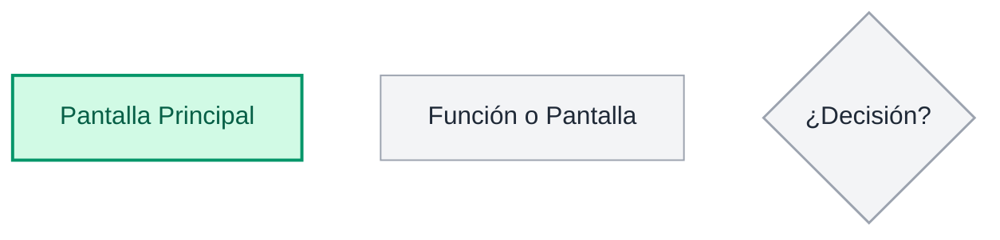
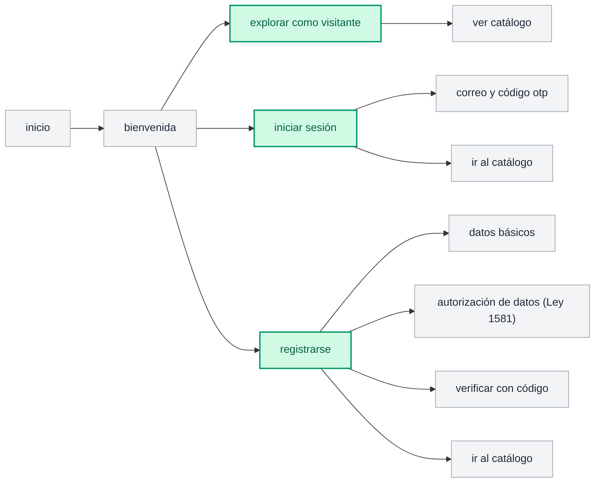
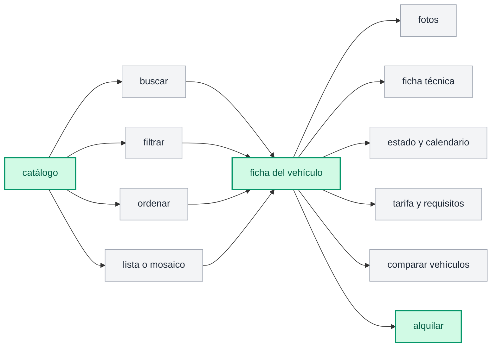
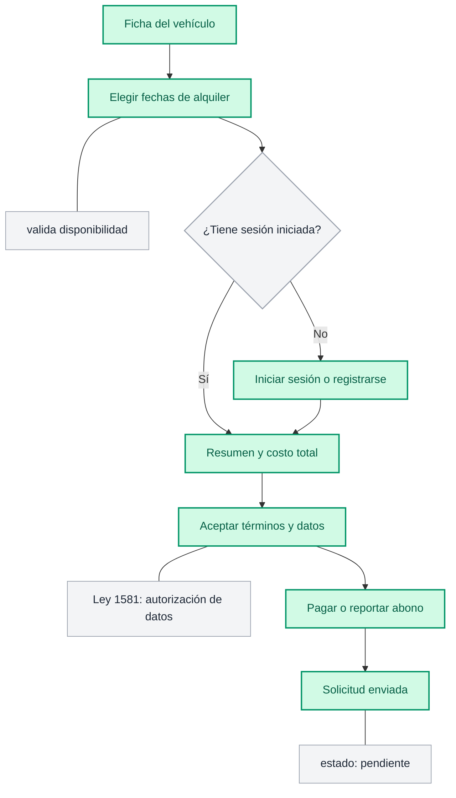
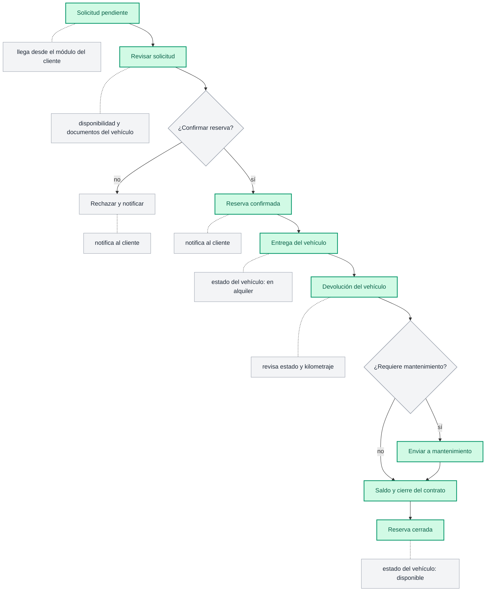
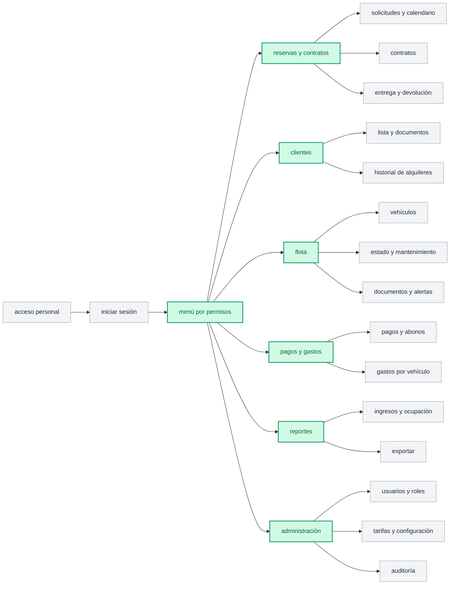
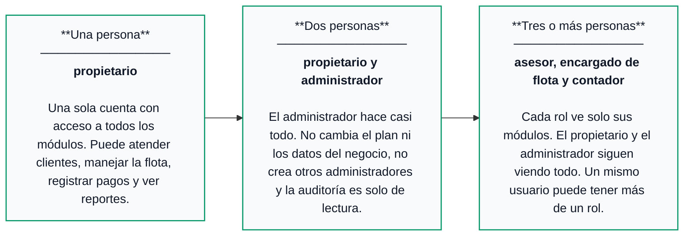
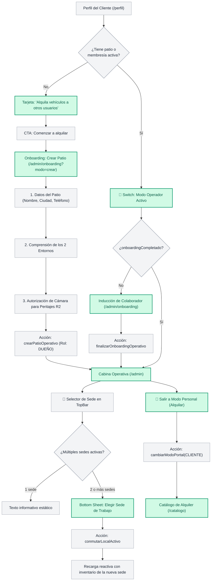

# User Flow: FlotaX — Navegación, Pantallas y Estados de Usuario

**Código:** DOC-UX-001  
**Proyecto:** FlotaX — Sistema de Alquiler de Vehículos  
**Ámbito:** Arquitectura de Interfaz, Mapa de Navegación y Flujos de Usuario  
**Fuente de Verdad:** Diagramas canónicos de User Flow (Onboarding, Personal, Operación, Roles y Matriz de Acceso)  

---

## 1. Visión General del Sistema y Convenciones

Los diagramas de flujo definen la estructura jerárquica de pantallas, componentes interactivos, bifurcaciones de negocio y ciclo de vida de la flota en FlotaX.

### Tipología Canónica de Nodos:
1. **Pantalla Principal (Verde Menta / Borde Verde):** Rutas y vistas canónicas primarias del sistema (ej. `bienvenida`, `menú por permisos`, `flota`, `entrega del vehículo`).
2. **Función o Pantalla (Gris Claro / Beige Neutro):** Subvistas, tabs, modales, formularios o pasos de soporte operativo (ej. `ver catálogo`, `datos básicos`, `correo y código otp`, `rechazar y notificar`).
3. **Punto de Decisión (Rombo / Condicional):** Bifurcaciones operativas del sistema (ej. `¿Confirmar reserva?`, `¿Requiere mantenimiento?`).

---

## 2. User Flow: Onboarding

Define la puerta de entrada, modalidades de acceso inicial para nuevos usuarios, clientes recurrentes y visitantes casuales.

> **Regla de Negocio de Onboarding:**  
> Si ya hay una sesión activa, la app salta la bienvenida y abre el catálogo directamente. La cédula y la licencia se piden la primera vez que el cliente alquila, no en el registro; en el registro únicamente se pide el nombre completo si esta persona no accede con Google.
>
> **Acceso Unificado y Resiliente con Google OAuth:**  
> El botón "Continuar con Google" unifica login y registro: si la cuenta no existe en la base de datos, se provisiona automáticamente (JIT) sin arrojar error al usuario ni obligarlo a reiniciar el flujo en la pestaña opuesta. Si el callback `/api/auth/callback/google` detecta cancelación o error, se redirige de forma segura a `/login` con mensajes en lenguaje humano y sin estados colgados o errores 500.

---

## 3. Flujo de Navegación del Cliente: Explorar y Analizar Vehículos

Flujo de descubrimiento, evaluación técnica y comparativa antes de pasar al embudo de alquiler.

### Especificación Funcional:
- **Catálogo (`/catalogo`):** Búsqueda por texto (marca, modelo, placa, tipo), filtrado con sincronización en URL, ordenamiento dinámico y alternancia de cuadrícula/lista.
- **Ficha del Vehículo (`/vehiculos/:id`):** Galería fotográfica en Cloudflare R2, ficha técnica, disponibilidad en tiempo real, desglose de tarifas y botón de acción (CTA) directo a alquilar.

---

## 4. Flujo Detallado: Alquilar un Vehículo (Embudo del Cliente)

Embudo transaccional paso a paso que cubre desde la selección de fechas hasta la solicitud preliminar del cliente.

---

## 5. User Flow: Operación de una Reserva (Personal o Administración)

Ciclo de vida operativo completo gestionado por el personal de patio y administración desde que entra una solicitud hasta el cierre final de la reserva.

### Estados y Puntos de Control Operativo:
1. **Solicitud pendiente:** Notificación entrante desde el portal del cliente con abono o solicitud radicada.
2. **Revisar solicitud:** Validación pericial de documentos del conductor, antecedentes y disponibilidad del vehículo.
3. **Decisión de Confirmación:**
   - **Rechazar y notificar:** Se cancela la solicitud y se devuelve notificación justificada al cliente.
   - **Reserva confirmada:** Generación de contrato preliminar y notificación formal al cliente.
4. **Entrega del vehículo:** Acta de entrega con inspección fotográfica pericial en Cloudflare R2. El vehículo pasa a estado `en alquiler`.
5. **Devolución del vehículo:** Peritaje de retorno, registro de kilometraje, combustible y novedades físicas.
6. **Decisión de Mantenimiento:**
   - Si presenta averías o requiere service, se deriva a `Enviar a mantenimiento` (estado temporal `en mantenimiento`).
   - Si está en condiciones óptimas, avanza a liquidación.
7. **Saldo y cierre del contrato:** Liquidación de depósitos en garantía, cobro de saldos o penalidades pendientes.
8. **Reserva cerrada:** Contrato finiquitado y el vehículo retorna inmediatamente a estado `disponible` en catálogo.

---

## 6. User Flow: Personal (Empleados y Dueño)

Arquitectura de módulos y funciones accesibles desde el entorno administrativo y operativo (`/admin`).

> **Principio de Visibilidad Dinámica:**  
> El menú muestra solo los módulos para los que el usuario tiene permiso. Con una sola persona (el propietario) se ven todos. Quién accede a cada pantalla está normado por la matriz de acceso.

---

## 7. User Flow: Crecimiento del Equipo y Roles

Modelo de adopción progresiva y escalamiento de responsabilidades en la organización de alquiler.

### Detalle de Etapas de Crecimiento:

| Etapa | Configuración | Responsabilidades y Alcance |
| :--- | :--- | :--- |
| **1. Una persona** | **Propietario** (`DUENO`) | Una sola cuenta con acceso absoluto a todos los módulos. Atiende clientes en patio, gestiona la flota, registra cobros/gastos y examina reportes. |
| **2. Dos personas** | **Propietario + Administrador** (`ADMIN`) | El administrador asume la operación regular diaria. Restricciones del administrador: no modifica la suscripción/plan ni datos fiscales maestros del negocio, no puede crear otros administradores y el módulo de auditoría es estrictamente de solo lectura. |
| **3. Tres o más personas** | **Asesor + Encargado de Flota + Contador** (`OPERATIVO`, `AUDITOR_FINANCIERO`) | Segregación de funciones por principio de mínimo privilegio (PoLP): • **Asesor:** Atiende reservas, contratos y clientes. • **Encargado de Flota:** Coordina entregas, devoluciones, mantenimiento y documentos técnicos de vehículos. • **Contador:** Supervisa pagos, abonos, gastos y reportes contables. *Nota:* Un mismo usuario puede tener más de un rol simultáneo. |

---

## 8. User Flow: Acceso por Módulo y Rol (Matriz RBAC Operativa)

Matriz de gobierno de accesos que dictamina la visibilidad y capacidad de acción en cada pantalla:

| Módulo | Pantalla | Propietario | Administrador | Asesor | Encargado de Flota | Contador |
| :--- | :--- | :---: | :---: | :---: | :---: | :---: |
| **Reservas y contratos** | Solicitudes y calendario | ✓ | ✓ | ✓ | L | L |
| | Contratos | ✓ | ✓ | ✓ | — | L |
| | Entrega y devolución | ✓ | ✓ | ✓ | ✓ | — |
| **Clientes** | Lista y documentos | ✓ | ✓ | ✓ | — | L |
| | Historial de alquileres | ✓ | ✓ | ✓ | — | L |
| **Flota** | Vehículos | ✓ | ✓ | L | ✓ | — |
| | Estado y mantenimiento | ✓ | ✓ | L | ✓ | L |
| | Documentos y alertas | ✓ | ✓ | L | ✓ | L |
| **Pagos y gastos** | Pagos y abonos | ✓ | ✓ | R | — | ✓ |
| | Gastos por vehículo | ✓ | ✓ | — | L | ✓ |
| **Reportes** | Ingresos y ocupación | ✓ | ✓ | — | L | ✓ |
| | Exportar | ✓ | ✓ | — | — | ✓ |
| **Administración** | Usuarios y roles | ✓ | R | — | — | — |
| | Tarifas y configuración | ✓ | R | — | — | — |
| | Auditoría | ✓ | L | — | — | — |

### Convenciones de Permisos:
- **`✓` Acceso completo:** Crear, leer, modificar y ejecutar acciones transaccionales.
- **`L` Solo lectura:** Consulta de información e informes sin capacidad de mutación de datos.
- **`R` Acceso limitado:** Acceso acotado a submódulos específicos o sin permisos de elevación/administración.
- **`—` Sin acceso:** El módulo o pantalla se oculta en el menú lateral y la ruta devuelve denegación de acceso (`403 Forbidden`).

---

## 9. Mapeo Canónico de Rutas de Implementación (Astro & RBAC)

| Módulo / Pantalla Canónica | Ruta Astro (`src/pages/...`) | Componentes de Dominio Clave | Nivel de Acceso Mínimo |
| :--- | :--- | :--- | :--- |
| **Inicio & Bienvenida** | `src/pages/index.astro` | `HeroBienvenida`, `CategoriasGlance` | Público / Visitante |
| **Catálogo** | `src/pages/catalogo/index.astro` | `CatalogoFiltros`, `VehiculoGrid`, `VistaToggle` | Público / Visitante |
| **Ficha del Vehículo** | `src/pages/vehiculos/[id].astro` | `GaleriaFotos`, `FichaTecnica`, `CalendarioDisponibilidad` | Público / Visitante |
| **Embudo: Fechas y Resumen** | `src/pages/alquilar/[id].astro` | `DateRangeSelector`, `ResumenCostos`, `TerminosLey1581` | Cliente Autenticado |
| **Mis Reservas (Cliente)** | `src/pages/reservas/index.astro` | `ReservasActivasList`, `HistorialReservasTable` | Cliente Autenticado |
| **Perfil del Cliente** | `src/pages/perfil/index.astro` | `DatosPersonalesForm`, `LicenciaUpload` | Cliente Autenticado |
| **Acceso Personal** | `src/pages/admin/login.astro` | `AdminLoginForm` | Público (Staff) |
| **Panel / Menú por Permisos** | `src/pages/admin/index.astro` | `AdminModuleNav`, `DashboardMetrics` | Personal (`tienePermiso`) |
| **Reservas: Solicitudes y Calendario** | `src/pages/admin/reservas/index.astro` | `SolicitudesTable`, `ReservasCalendario` | Asesor / Encargado (L) / Contador (L) |
| **Reservas: Contratos** | `src/pages/admin/contratos/index.astro` | `ContratosList`, `ContratoViewer` | Asesor / Contador (L) |
| **Reservas: Entrega y Devolución** | `src/pages/admin/operaciones/index.astro` | `CheckInCheckOutForm`, `InspeccionPericialR2` | Asesor / Encargado de Flota |
| **Clientes: Lista y Documentos** | `src/pages/admin/clientes/index.astro` | `ClientesTable`, `DocumentosValidador` | Asesor / Contador (L) |
| **Flota: Vehículos y Mantenimiento** | `src/pages/admin/flota/index.astro` | `FlotaGrid`, `MantenimientoForm`, `AlertasVencimiento` | Encargado de Flota / Asesor (L) |
| **Pagos y Gastos** | `src/pages/admin/caja/index.astro` | `AbonosTable`, `GastosVehiculoForm` | Contador / Asesor (R) |
| **Reportes y Exportación** | `src/pages/admin/reportes/index.astro` | `IngresosOcupacionChart`, `ExportarCSVButton` | Contador / Encargado (L) |
| **Administración: Config y Auditoría** | `src/pages/admin/configuracion/index.astro` | `UsuariosRolesManager`, `TarifasConfig`, `AuditoriaTable` | Propietario / Administrador (R/L) |
| **Inducción Operativa de Patio** | `src/pages/admin/onboarding.astro` | `OnboardingStepsWizard`, `CamaraPermissionGate` | Personal con `onboardingCompletado = false` |

---

## 10. User Flow: Paradigma de Portal Persistente (Switch Explícito y Creación de Patio)

Define la alternancia entre la experiencia de cliente consumidor y la cabina operativa de patio sin fragmentación de cuentas ni credenciales duplicadas, permitiendo además que cualquier cliente ofrezca sus vehículos en alquiler.

### Reglas de Negocio del Paradigma de Portal:
1. **Autonomía y Rol DUEÑO:** Cualquier cliente puede crear libremente un nuevo patio de alquiler, convirtiéndose automáticamente en `DUENO` con soberanía total sobre su flota, tarifas y personal.
2. **Segregación de Roles por Invitación:** Los roles operativos sobre patios existentes (`ADMIN`, `OPERATIVO`, `AUDITOR_FINANCIERO`) requieren una invitación transaccional emitida por el dueño.
3. **Identidad Canónica Única:** Una sola cuenta (`user.id`) aloja tanto el historial personal como las atribuciones de patio.
4. **Persistencia Transparente:** La sede y el portal elegidos persisten en cookies HTTP-only seguras (`movix_local_activo` y `movix_portal_modo`).
5. **Prevención de Conflicto de Interés:** El personal o dueño que alquile como cliente está sujeto a las mismas validaciones de riesgo y tarifas regulares; queda prohibido el auto-peritaje de entrega/devolución.

