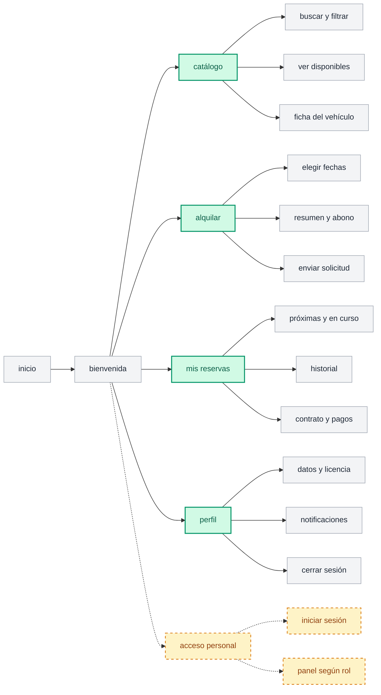
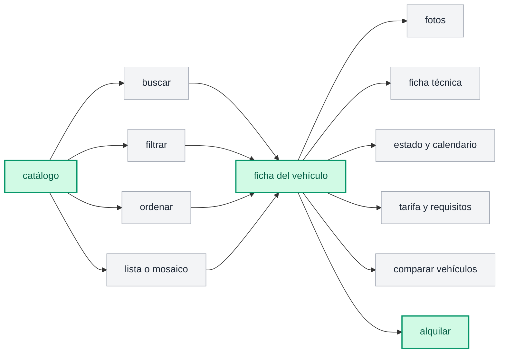
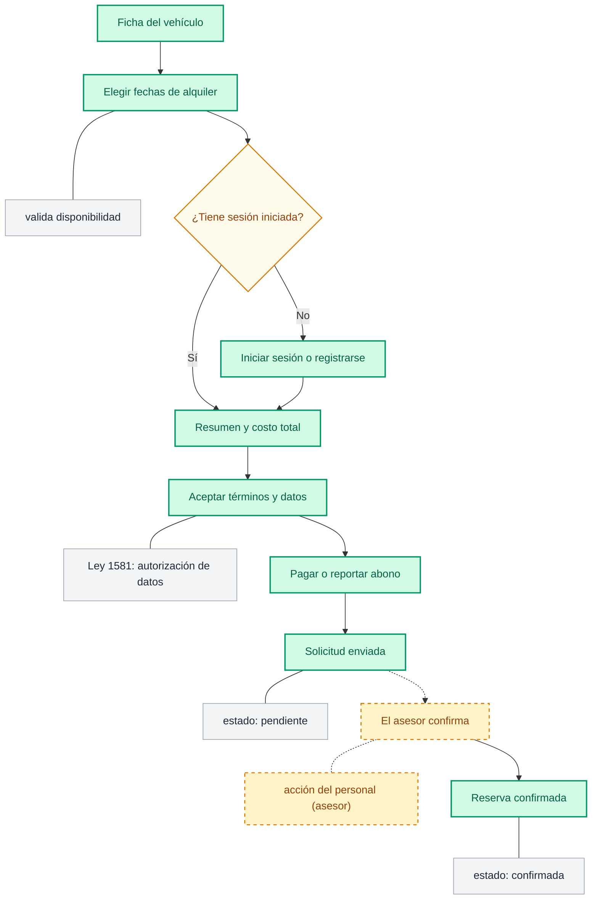

# User Flow: FlotaX — Navegación, Pantallas y Estados de Usuario

**Código:** DOC-UX-001  
**Proyecto:** FlotaX — Sistema de Alquiler de Vehículos  
**Ámbito:** Arquitectura de Interfaz, Mapa de Navegación y Flujos de Usuario  
**Fuente de Verdad:** Diagramas canónicos de User Flow (Cliente y Personal Operativo)  

---

## 1. Visión General del Sistema y Convenciones

Los diagramas de flujo definen la estructura jerárquica de pantallas, componentes interactivos y bifurcaciones de negocio del sistema FlotaX.

### Tipología de Nodos:
1. **Pantalla Principal (Verde / Primaria):** Rutas canónicas completas con su propio URL (ej. `/`, `/catalogo`, `/vehiculo/:id`, `/reservas`).
2. **Función o Pantalla (Gris Claro):** Subvistas, tabs, modales, drawers o componentes interactivos dentro de una pantalla principal.
3. **Flujo Aparte (Borde Discontinuo / Punteado):** Flujo de backoffice/personal operativo (ej. asesores, mecánicos, administradores) con control de acceso RBAC.

---

## 2. Mapa General del Cliente

Estructura de primer y segundo nivel accesible desde el punto de entrada de la aplicación.

### Detalle de Módulos del Mapa General:

| Módulo Principal | Ruta Propuesta | Pantallas / Funcionalidades Hijas | Propósito y Reglas |
| :--- | :--- | :--- | :--- |
| **Inicio & Bienvenida** | `/` | Hero interactivo, llamada a la acción rápida, selector de categoría. | Punto de aterrizaje para capturar la intención inmediata del cliente. |
| **Catálogo** | `/catalogo` | Buscar y filtrar, ver disponibles, acceso a ficha de vehículo. | Exploración rápida de flota disponible con filtros en URL (`nuqs`). |
| **Alquilar** | `/alquilar` o `/vehiculo/:id/alquilar` | Selector de fechas, resumen y cálculo de abono, envío de solicitud. | Flujo guiado de reserva y compromiso de anticipo. |
| **Mis Reservas** | `/reservas` | Próximas y en curso, historial completo, visualización de contratos y pagos. | Portal post-venta y seguimiento del estado de la reserva del cliente autenticado. |
| **Perfil** | `/perfil` | Datos personales y foto/validación de licencia, notificaciones, cerrar sesión. | Gestión de identidad, antecedentes de conducción y contacto. |
| **Acceso Personal** | `/personal/login` → `/admin` | Iniciar sesión administrativo, redirección al panel según rol (Admin, Asesor, Mecánico). | Flujo restringido y protegido por Better Auth y RBAC. |

---

## 3. Flujo Detallado: Explorar y Analizar Vehículos

Flujo específico de descubrimiento, evaluación técnica y comparativa antes de pasar al embudo de alquiler.

### Especificación Funcional de Pantallas:

#### A. Pantalla: Catálogo (`/catalogo`)
- **Controles de búsqueda y filtros:**
  - `buscar`: Búsqueda por texto (marca, modelo, placa, tipo).
  - `filtrar`: Rango de precio, categoría (auto, moto, scooter/patineta), tipo de transmisión, combustible/eléctrico, sucursal.
  - `ordenar`: Menor a mayor precio, más recientes, disponibilidad inmediata.
  - `lista o mosaico`: Alternancia de layout sin recargar la página.
- **Interacción:** Al hacer clic en cualquier tarjeta de vehículo, navega a la Ficha del Vehículo (`/vehiculo/:id`).

#### B. Pantalla: Ficha del Vehículo (`/vehiculo/:id`)
- **Secciones / Capacidades:**
  1. `fotos`: Galería de alta resolución con optimización y visor modal/carrusel.
  2. `ficha técnica`: Pasajeros, maletas, transmisión, autonomía, potencia y características de seguridad.
  3. `estado y calendario`: Indicador en tiempo real de disponibilidad y fechas bloqueadas por mantenimiento o reservas vigentes.
  4. `tarifa y requisitos`: Detalle de tarifa diaria, descuentos (>7 días), depósito en garantía y requisitos de edad/licencia.
  5. `comparar vehículos`: Drawer o modal de contraste frente a 1-2 vehículos de la misma categoría.
  6. `alquilar` (CTA Principal): Disparador directo hacia el embudo de alquiler transfiriendo el vehículo seleccionado.

---

## 4. Flujo Detallado: Alquilar un Vehículo

Embudo transaccional paso a paso que cubre desde la selección de fechas hasta la confirmación definitiva por parte del asesor.

### Matriz de Pasos y Reglas de Negocio del Embudo:

| Paso | Pantalla / Estado | Tipo | Acciones y Reglas de Negocio |
| :--- | :--- | :--- | :--- |
| **1** | **Ficha del vehículo** | Pantalla Principal | Punto de origen donde el usuario presiona "Alquilar". |
| **2** | **Elegir fechas de alquiler** | Pantalla Principal / Modal | Selector con rango de fecha y hora (recogida y devolución). Ejecuta validación instantánea de disponibilidad en base de datos. |
| **3** | **¿Tiene sesión iniciada?** | Bifurcación / Guardián | - Si `sesión == activa`: Redirige a Resumen y costo total. - Si `sesión == nula`: Redirige a **Iniciar sesión o registrarse** (preservando estado del carrito de reserva en URL/sessionStorage). |
| **4** | **Iniciar sesión o registrarse** | Pantalla Principal | Autenticación con Better Auth. Al completar con éxito, regresa automáticamente al paso 5. |
| **5** | **Resumen y costo total** | Pantalla Principal | Desglose transparente: días, tarifa base, seguro, depósito/garantía y monto del abono inicial requerido. |
| **6** | **Aceptar términos y datos** | Pantalla Principal / Drawer | Checkbox legal mandatorio: Política de tratamiento de datos personales (**Ley 1581**) y contrato preliminar de alquiler. |
| **7** | **Pagar o reportar abono** | Pantalla Principal | Pasarela digital integrada o subida de comprobante de transferencia bancaria/efectivo. |
| **8** | **Solicitud enviada** | Pantalla Principal | Pantalla de confirmación preliminar con código de seguimiento. **Estado:** `pendiente`. Se notifica al cliente y al asesor. |
| **9** | **El asesor confirma** | Acción de Personal (Backoffice) | El asesor operativo valida la licencia, visita domiciliaria (si aplica) y pago del abono en el panel administrativo. |
| **10** | **Reserva confirmada** | Pantalla Principal / Notificación | Cambio de estado a `confirmada`. Notificación al cliente por WhatsApp/Email y generación de hoja de ruta de entrega. |

---

## 5. Mapeo de Rutas de Implementación (Convención Astro)

| Pantalla Canónica | Ruta Astro (`src/pages/...`) | Componentes Dominio |
| :--- | :--- | :--- |
| Inicio & Bienvenida | `src/pages/index.astro` | `HeroBienvenida`, `CategoriasGlance`, `DestacadosGrid` |
| Catálogo | `src/pages/catalogo/index.astro` | `CatalogoFiltros`, `VehiculoGrid`, `VistaToggle` |
| Ficha del Vehículo | `src/pages/vehiculos/[id].astro` | `GaleriaFotos`, `FichaTecnica`, `CalendarioDisponibilidad`, `BotonAlquilar` |
| Embudo: Fechas y Resumen | `src/pages/alquilar/[id].astro` | `DateRangeSelector`, `ResumenCostos`, `TerminosLey1581` |
| Pago / Abono | `src/pages/alquilar/[id]/pago.astro` | `MetodosPagoIsland`, `ComprobanteUpload` |
| Estado Solicitud | `src/pages/reservas/[id]/estado.astro` | `EstadoTimeline`, `DetalleReservaCard` |
| Mis Reservas | `src/pages/reservas/index.astro` | `ReservasActivasList`, `HistorialReservasTable` |
| Perfil de Usuario | `src/pages/perfil/index.astro` | `DatosPersonalesForm`, `LicenciaUpload`, `ConfigNotificaciones` |
| Acceso Personal | `src/pages/admin/login.astro` | `AdminLoginForm` |
| Panel Administrativo | `src/pages/admin/dashboard.astro` | `DashboardMetricCards`, `SolicitudesPendientesTable` |
